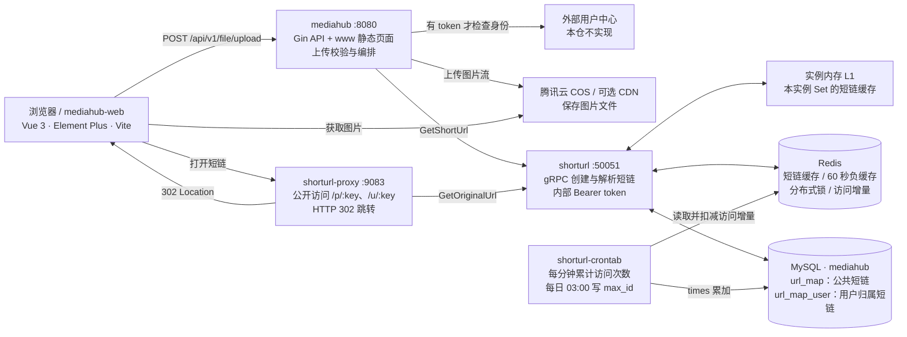
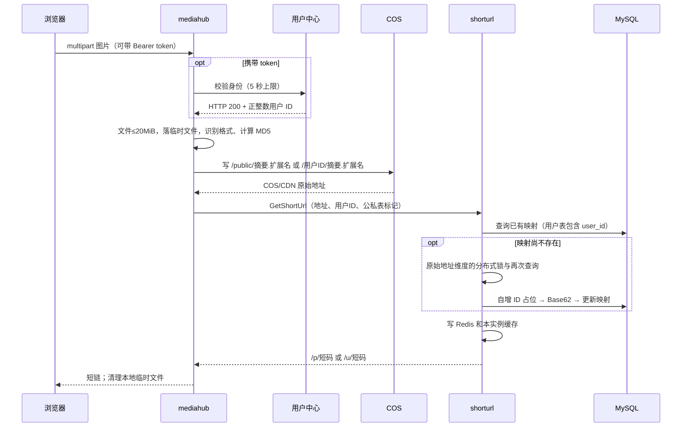
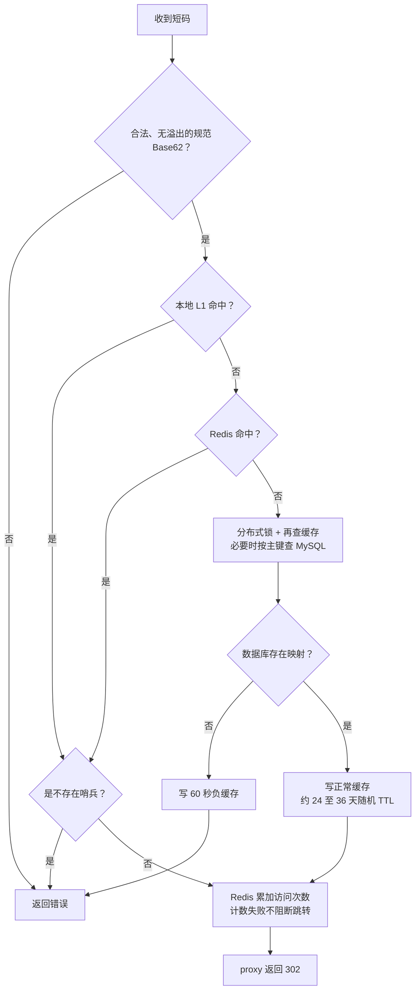

# MediaHub 架构总览

更新：2026-09-22。依据 `6233022` 及本轮 review 修复代码。图中端口来自 example 配置，不代表生产部署状态。

MediaHub 当前是一个图片上传与短链分享系统：浏览器上传图片，服务把文件放进 COS，把地址映射保存在 MySQL，访问短链时跳转到 COS/CDN。它还不是包含素材列表、搜索、删除、转码或权限分享的完整媒体资产平台。

## 一张图看全局

## 组件职责与代码入口

| 组件 | 职责 | 当前入口 |
|---|---|---|
| `mediahub-web` | 首页素材展示、上传、复制短链、读取 SSO cookie | `src/views/home.vue`、`src/views/components/upload.vue`、`src/request/axios.ts` |
| `mediahub` | HTTP 鉴权、流式接收图片、调用 COS、申请短链；托管 `www` | `main.go`、`middleware/auth.go`、`controller/file.go` |
| `shorturl` | 两张映射表的创建/查询、Base62 短码、缓存和访问计数 | `shorturl-server/main.go`、`server/server.go`、`data/url_map.go` |
| `shorturl-proxy` | 接收短链 URL、调用解析服务、返回 302 | `main.go`、`proxy/proxy.go` |
| `shorturl-crontab` | 将 Redis 访问增量逐条写入 MySQL；维护历史 max_id 缓存 | `cron/crontab.go`、`cron/access_count.go` |

四个 Go 目录是四个独立 module，分别测试/构建；前端也是独立构建。前端 `build:embedded` 会把构建结果同步到 `mediahub/www`。用户中心、COS、MySQL、Redis 是外部依赖。

## 上传到分享的顺序

允许 JPG、PNG、GIF、WebP，格式来自内容识别；匿名上传仍受支持。COS 与 MySQL 写入不是跨系统事务：COS 成功、短链失败时返回错误，对象可能已存在；相同内容会复用确定的对象路径。

## 解析与缓存规则

- MySQL 是映射事实来源。布隆过滤器只预热部分记录，而且旧实现多实例整块覆盖，因此本轮已移出生产请求；其历史组件代码仍保留，不能直接重新接入。
- crontab 每日生成的 `max_id` 是旧快照，本轮不再用它拒绝短链；维护任务仍保留以兼容历史运行方式。
- 从 Redis `Get` 得不到剩余 TTL，本轮不再据此给 L1 重置约 30 天有效期。本实例显式 `Set` 仍可写 L1，TTL 不再重复随机放大。
- 不存在的短链通过短期负缓存减少重复查询；去掉错误索引拦截后，随机不同短码的数据库请求量可能上升，需要结合真实流量配置入口限流。
- Redis 故障仍可能阻断正常解析；当前只有锁失败允许直接查询 MySQL，不代表整个缓存层已具备故障降级。

## 数据和安全边界

| 对象 | 谁维护 | 实际语义 |
|---|---|---|
| 图片字节 | COS | 数据库不存图片内容 |
| `url_map` | shorturl | 匿名公共上传映射；非空原始 URL 唯一索引见 SQL |
| `url_map_user` | shorturl | 用户归属映射；按 `user_id + original_url` 查找/约束 |
| `/u/:key` | proxy | **不是私密访问**；没有登录验证，拿到 URL 即可访问 |
| `times` | crontab | 异步近似访问统计，不能当作精确计费账本 |
| SSO 身份 | 外部用户中心 | 本仓消费身份，不负责注册和登录签发 |
| 内部 gRPC 凭证 | 配置 + interceptor | 服务间共享 token，不是终端用户访问授权 |

没有发现已接入的图片生命周期清理、短链过期、用户素材管理、转码、审核、精确统计账本或容器编排。健康检查主要是进程探活，不能证明 COS、MySQL、Redis 或用户中心可用。

## 本轮审查

修复明细、失败复现、验证结果和剩余风险见 [review 报告](reviews/2026-09-22-review.md)。图示对应本轮修复后的代码，而非旧 PNG 里的设计设想。
